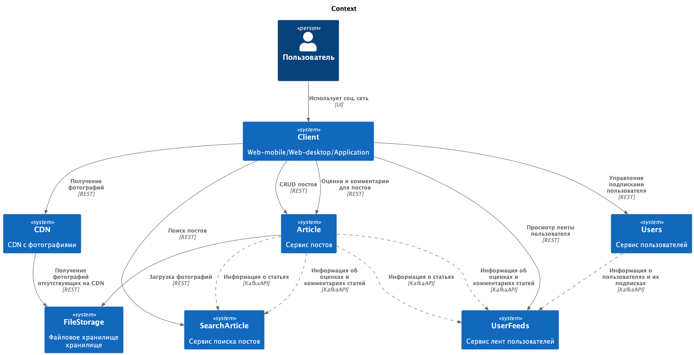
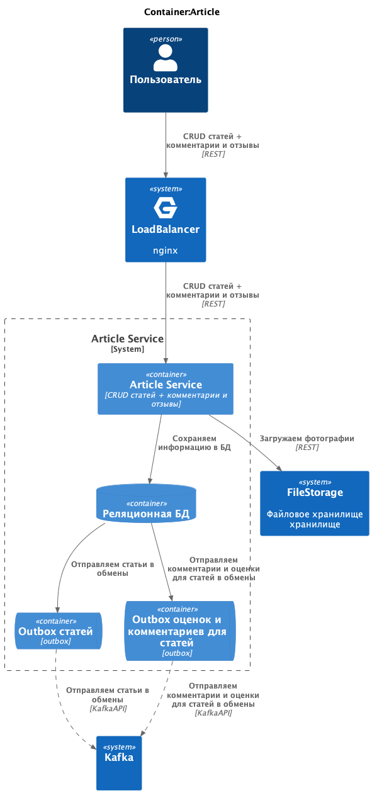
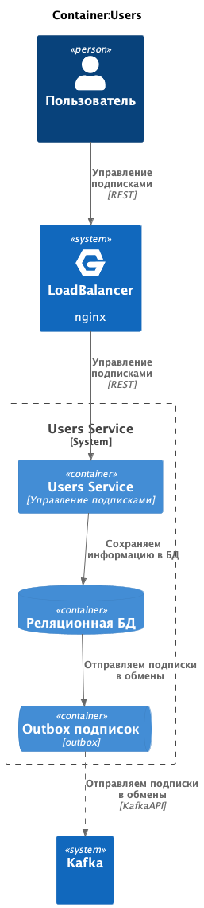
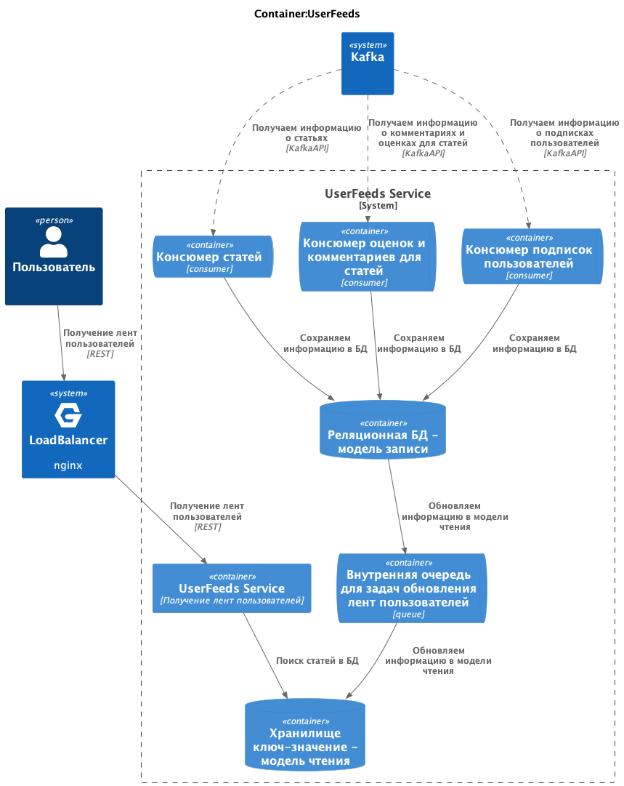

# social_network_system_design

# Социальна сеть для путешественников

### Functional requirements:

- публикация постов из путешествий с фотографиями, небольшим описанием и привязкой к конкретному месту путешествия;
- оценка и комментарии постов других путешественников;
- подписка на других путешественников, чтобы следить за их активностью;
- поиск популярных мест для путешествий и просмотр постов с этих мест;
- просмотр ленты других путешественников и ленты пользователя, основанной на подписках в обратном хронологическом порядке;
- мобильные устройства и браузер;

### Non-functional requirements:

- 10 000 000 DAU
- availability 99,95%
- посты - в среднем 1 пост в месяц от активного пользователя
  - от 1 до 5 фотографий, макс размер фотографии - 200 Кб (кроппинг и сжатие на клиенте перед загрузкой)
  - до 1000 символов описания
  - геолокация
  - максимум 100 постов в день
- оценки и комментарии - в среднем 10 комментариев в день от активного пользователя
  - до 100 символов
  - без картинок
  - максимум 1000 комментариев в день
- просмотр комментариев - в среднем 10 просмотров в день от активного пользователя
  - по 20 комментариев
- реакции - в среднем 100 реакций в день от активного пользователя
  - максимум 10 000 реакций в день от активного пользователя
- подписка на других путешественников - в среднем 1 подписка в день от активного пользователя
  - максимум 1000 подписок в день
  - максимум 1000 подписок всего у одного пользователя
  - не ограничений в подписках на 1 одного пользователя
- поиск популярных мест для путешествий и просмотр постов с этих мест - в среднем 10 поисков (просмотр по 100 постов) в день от активного пользователя
  - популярность считаем по кол-ву постов и комментариев
- просмотр ленты - в среднем 10 просмотров (просмотр по 10 постов) в день от активного пользователя
- реакции, посты и комментарии храним вечно
- максимальная длительность ленты - 1 год или 1000 событий
- гео-распределенность не требуется
- аудитория стран СНГ
- есть сезонность - считаем как нагрузку как х3 от обычной
  - лето
  - каникулы (по 1 неделе в октябре, ноябре, январе и апреле)
  - новогодние праздники
  - длинные выходные

## Design overview

### Level 1. System context diagram

## Basic calculations

RPS (создание постов):

    DAU = 10 000 000
    1 пост в месяц от активного пользователя
    RPS = 10 000 000 / 86 400 / 30 ~= 4

    от 1 до 5 фотографий, макс размер фотографии - 200 Кб
    до 1000 символов описания (~2kB)
    Traffic = 5 * 2 Кб * 4RPS = 40 Кб/с
    Traffic картинки = 5 * 200 Кб * 4RPS = 4 000 Кб/с = 2 Мб/с

RPS (оставить оценки с комментариями):

    DAU = 10 000 000
    10 комментариев в день
    RPS = 10 000 000 * 10 / 86 400 ~= 1 200

    до 100 символов ~200B, без картинок
    Traffic = 200B * 1 200RPS = 240 000 B/c = 0.24 Мб/с

RPS (просмотр комментариев):

    DAU = 10 000 000
    10 просмотров в день по 20 комментариев
    RPS = 10 000 000 * 10 / 86 400 ~= 1 200

    до 100 символов ~200B, без картинок
    Traffic = 200B * 20 * 1 200RPS = 4 800 000 B/c = 4.8 Мб/с

RPS (реакции):

    DAU = 10 000 000
    100 реакций в день
    RPS = 10 000 000 * 100 / 86 400 ~= 12 000

    1 реакция 10 B
    Traffic = 10 B * 12 000RPS = 120 000 B/c = 0.12 Мб/с

RPS (реакции чтение):

    RPS (поиск) = 1 200 по 100 постов
    RPS (лента) = 1 200 по 10 постов

    1 пост = 3 реакции по 8 байт = 24 Б

    Traffic = 1 200 RPS * 100 * 24 Б + 1 200 RPS * 10 * 24 Б = 3 168 000 B/c = 3.2 Мб/с

RPS (подписки):

    DAU = 10 000 000
    1 подписка в день
    RPS = 10 000 000 * 1 / 86 400 ~= 120

    Traffic = 8B * 120RPS = 960 B/c

RPS (поиск):

    DAU = 10 000 000
    10 поисков в день
    RPS = 10 000 000 * 10 / 86 400 ~= 1 200

    по 100 постов, не учитываем картинки - считаем, что отдаем ссылки на фотографии
    Traffic = 100 * 2kB * 1 200RPS = 240 000 kB/c = 240 Мб/с

    картинки с CDN
    Traffic CDN = 100 * 5 * 200 Кб * 1 200 RPS = 120 000 000 Кб/c = 120 Гб/с

RPS (просмотр ленты):

    DAU = 10 000 000
    10 просмотров ленты в день
    RPS = 10 000 000 * 10 / 86 400 ~= 1 200

    по 10 постов, не учитываем картинки - считаем, что отдаем ссылки на фотографии
    Traffic = 10 * 2kB * 1 200RPS = 24 000 kB/c = 24 Мб/с

    картинки с CDN
    Traffic = 10 * 5 * 200 Кб * 1 200RPS = 60 000 Мб/c = 60 Гб/с

RPS (создание ленты):

    DAU = 10 000 000
    1 создание ленты в день CRON
    RPS = 10 000 000 * 1 / 86 400 ~= 120

    по 100 постов, каждый по 8 B
    Traffic = 100 * 8 B * 120 RPS = 96 000 B/c = 96 kB/c

Requirements:

    RPS ~= 4 + 1 200 + 12 000 + 120 + 1 200 + 1 200 + 1 200 = 20 000
    Traffic ~= 2 Мб/с + 0.24 Мб/с + 0.12 Мб/с + 240 Мб/с + 24 Мб/с + 5 Мб/с = 300 Мб/с

    RPS CDN ~= 4 (загрузка) * 5 + 1 200 (поиск) * 5 * 100 + 1 200 (лента) * 5 * 10 = 660 000
    Traffic CDN ~= 200 Гб/с

    Хранилище картинок на 5 лет = 2 Мб/с * 86 400 * 365 * 5 = 315 360 000 Мб = 315 Тб

Disk estimations:

    # Comments - HDD
    Сapacity = 0.24 МБ/с \* 86 400 \* 365 = 7.5 ТБ
    Disks_for_capacity = 7.5 ТБ / 2 ТБ = 3.75
    Disks_for_throughput = 0.24 МБ/с (запись) + 4.8 Мб/с (чтение) / 100 МБ/с = 0.0504
    Disks_for_iops = (1 200 (RPS на запись) + 1 200 (RPS на чтение)) * 3 (магический коэфициент) / 100 = 72
    Disks = max(ceil(3.75), ceil(0.0504), ceil(72)) = 72

    # Comments - SATA - выбираем этот вариант для БД
    Сapacity = 0.24 МБ/с \* 86 400 \* 365 = 7.5 ТБ
    Disks_for_capacity = 7.5 ТБ / 2 ТБ = 3.75
    Disks_for_throughput = 0.24 МБ/с (запись) + 4.8 Мб/с (чтение) / 500 МБ/с = 0.01008
    Disks_for_iops = (1 200 (RPS на запись) + 1 200 (RPS на чтение)) * 3 (магический коэфициент) / 1000 = 7.2
    Disks = max(ceil(3.75), ceil(0.01008), ceil(7.2)) = 8

    # file_storage - HDD
    Сapacity = 2 МБ/с \* 86 400 \* 365 = 63 ТБ
    Disks_for_capacity = 63 ТБ / 2 ТБ = 31.5
    Disks_for_throughput = 2 МБ/с (запись) + 120 Гб/с (чтение поиск) + 60 Гб/с (чтение лента) / 100 МБ/с = 1 800
    Disks_for_iops = (4 (RPS на запись) + 1 200 RPS (чтение поиск) + 1 200 RPS (чтение лента)) * 3 (магический коэфициент) / 100 = 72
    Disks = max(ceil(31.5), ceil(1 800), ceil(72)) = 1 800

    # file_storage - SATA - выбираем этот вариант для БД
    Сapacity = 2 МБ/с \* 86 400 \* 365 = 63 ТБ
    Disks_for_capacity = 63 ТБ / 2 ТБ = 31.5
    Disks_for_throughput = 2 МБ/с (запись) + 120 Гб/с (чтение поиск) + 60 Гб/с (чтение лента) / 500 МБ/с = 360
    Disks_for_iops = (4 (RPS на запись) + 1 200 RPS (чтение поиск) + 1 200 RPS (чтение лента)) * 3 (магический коэфициент) / 1000 = 7.2
    Disks = max(ceil(31.5), ceil(360), ceil(72)) = 360

    # Posts - HDD - выбираем этот вариант для БД
    Сapacity = 40 Кб/с \* 86 400 \* 365 = 1.2 ТБ
    Disks_for_capacity = 1.2 ТБ / 2 ТБ = 0.6
    Disks_for_throughput = 40 Кб/с (запись) + 40 Кб/с (аутбокс) / 100 МБ/с = 0.0008
    Disks_for_iops = (4 (RPS на запись) + 4 (RPS аутбокс)) * 3 (магический коэфициент) / 100 = 0.24
    Disks = max(ceil(0.6), ceil(0.0008), ceil(0.24)) = 1

    # Search_posts_read - HDD - выбираем этот вариант для БД
    Сapacity = 40 Кб/с \* 86 400 \* 365 = 1.2 ТБ
    Disks_for_capacity = 1.2 ТБ / 2 ТБ = 0.6
    Disks_for_throughput = 40 Кб/с (запись) + 240 Мб/с (поиск) / 100 МБ/с = 2.4
    Disks_for_iops = (4 (RPS на запись) + 1 200 (RPS поиск)) * 3 (магический коэфициент) / 100 = 36
    Disks = max(ceil(0.6), ceil(2.4), ceil(36)) = 36

    # Search_posts_write - HDD - выбираем этот вариант для БД
    Сapacity = 40 Кб/с \* 86 400 \* 365 = 1.2 ТБ
    Disks_for_capacity = 1.2 ТБ / 2 ТБ = 0.6
    Disks_for_throughput = 40 Кб/с (запись) / 100 МБ/с = 0.0004
    Disks_for_iops = (4 (RPS на запись) + 4 (RPS внутренняя очередь)) * 3 (магический коэфициент) / 100 = 0.32
    Disks = max(ceil(0.6), ceil(0.0004), ceil(0.32)) = 1

    # Reactions - HDD
    Сapacity = 0.12 Мб/с \* 86 400 \* 365 = 3.8 ТБ
    Disks_for_capacity = 3.8 ТБ / 2 ТБ = 1.9
    Disks_for_throughput = 0.12 МБ/с (запись) + 3.2 Мб/с (чтение поиск + лента) / 100 МБ/с = 0.0332
    Disks_for_iops = (12 000 (RPS на запись) + 1 200 (RPS поиск) + 1 200 (RPS лента)) * 3 (магический коэфициент) / 100 = 432
    Disks = max(ceil(1.9), ceil(0.0332), ceil(432)) = 1

    # Reactions - nVME - выбираем этот вариант для БД
    Сapacity = 0.12 Мб/с \* 86 400 \* 365 = 3.8 ТБ
    Disks_for_capacity = 3.8 ТБ / 2 ТБ = 1.9
    Disks_for_throughput = 0.12 МБ/с (запись) + 3.2 Мб/с (чтение поиск + лента) / 3 ГБ/с = 0.00996
    Disks_for_iops = (12 000 (RPS на запись) + 1 200 (RPS поиск) + 1 200 (RPS лента)) * 3 (магический коэфициент) / 10 000 = 4.32
    Disks = max(ceil(1.9), ceil(0.00996), ceil(4.32)) = 5

    # User_feeds_read - HDD
    храним только 1 ленты для пользователя
    Сapacity = 10 000 000 DAU * 100 (постов в ленте) * 2 kB (размер поста) = 2 000 000 000 kB = 2 ТБ
    Disks_for_capacity = 2 ТБ / 2 ТБ = 1
    Disks_for_throughput = 96 kB/c (создание лент) + 40 Кб/с (создание постов) / 100 МБ/с = 0.00136
    Disks_for_iops = (120 (RPS создание лент) + 1 200 (RPS поиск)) * 3 (магический коэфициент) / 100 = 39.6
    Disks = max(ceil(1), ceil(0.00136), ceil(39.6)) = 40

    # User_feeds_read - SATA - выбираем этот вариант для БД
    храним только 1 ленты для пользователя
    Сapacity = 10 000 000 DAU * 100 (постов в ленте) * 2 kB (размер поста) = 8 000 000 000 B = 2 ТБ
    Disks_for_capacity = 2 ТБ / 2 ТБ = 1
    Disks_for_throughput = 96 kB/c (создание лент) + 40 Кб/с (создание постов) / 500 МБ/с = 0.000272
    Disks_for_iops = (120 (RPS создание лент) + 1 200 (RPS поиск)) * 3 (магический коэфициент) / 1000 = 3.96
    Disks = max(ceil(1), ceil(0.000272), ceil(3.96)) = 4

    # User_feeds_write - HDD - выбираем этот вариант для БД
    Сapacity = 960 B/c (подписка) + 2kB (посты) \* 86 400 \* 365 = 94 ГБ
    Disks_for_capacity = 94 ГБ / 2 ТБ = 0.047
    Disks_for_throughput = 40 Кб/с (посты) + 960 B/c (подписки) + 96 kB/c (создание лент)/ 100 МБ/с = 0.00137
    Disks_for_iops = (120 (RPS создание лент) + 4 (RPS создание постов) + 120 (RPS подписки)) * 3 (магический коэфициент) / 100 = 7.32
    Disks = max(ceil(0.047), ceil(0.00137), ceil(7.32)) = 8

    # User_subscription - HDD - выбираем этот вариант для БД
    Сapacity = 960 B/c (подписка) \* 86 400 \* 365 = 32 ГБ
    Disks_for_capacity = 32 ГБ / 2 ТБ = 0.016
    Disks_for_throughput = 960 B/c (подписки) + 960 kB/c (аутбокс)/ 100 МБ/с = 0.00002
    Disks_for_iops = (120 (RPS подписки) + 120 (RPS аутбокс)) * 3 (магический коэфициент) / 100 = 7.2
    Disks = max(ceil(0.016), ceil(0.00002), ceil(7.2)) = 8
