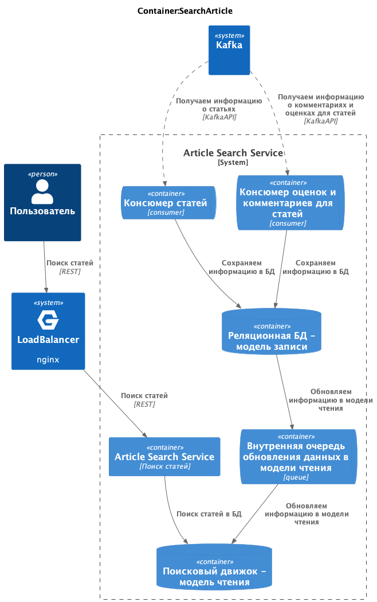

# social_network_system_design

# Социальна сеть для путешественников

### Functional requirements:

- публикация постов из путешествий с фотографиями, небольшим описанием и привязкой к конкретному месту путешествия;
- оценка и комментарии постов других путешественников;
- подписка на других путешественников, чтобы следить за их активностью;
- поиск популярных мест для путешествий и просмотр постов с этих мест;
- просмотр ленты других путешественников и ленты пользователя, основанной на подписках в обратном хронологическом порядке;
- мобильные устройства и браузер;

### Non-functional requirements:

- 10 000 000 DAU
- availability 99,95%
- посты - в среднем 1 пост в месяц от активного пользователя
  - от 1 до 5 фотографий, макс размер фотографии - 200 Кб (кроппинг и сжатие на клиенте перед загрузкой)
  - до 1000 символов описания
  - геолокация
  - максимум 100 постов в день
- оценки и комментарии - в среднем 10 комментариев в день от активного пользователя
  - до 100 символов
  - без картинок
  - максимум 1000 комментариев в день
- просмотр комментариев - в среднем 10 просмотров в день от активного пользователя
  - по 20 комментариев
- реакции - в среднем 100 реакций в день от активного пользователя
  - максимум 10 000 реакций в день от активного пользователя
- подписка на других путешественников - в среднем 1 подписка в день от активного пользователя
  - максимум 1000 подписок в день
  - максимум 1000 подписок всего у одного пользователя
  - не ограничений в подписках на 1 одного пользователя
- поиск популярных мест для путешествий и просмотр постов с этих мест - в среднем 10 поисков (просмотр по 100 постов) в день от активного пользователя
  - популярность считаем по кол-ву постов и комментариев
- просмотр ленты - в среднем 10 просмотров (просмотр по 10 постов) в день от активного пользователя
- реакции, посты и комментарии храним вечно
- максимальная длительность ленты - 1 год или 1000 событий
- гео-распределенность не требуется
- аудитория стран СНГ
- есть сезонность - считаем как нагрузку как х3 от обычной
  - лето
  - каникулы (по 1 неделе в октябре, ноябре, январе и апреле)
  - новогодние праздники
  - длинные выходные

## Design overview

### Level 1. System context diagram

## Basic calculations

RPS (создание постов):

    DAU = 10 000 000
    1 пост в месяц от активного пользователя
    RPS = 10 000 000 / 86 400 / 30 ~= 4

    от 1 до 5 фотографий, макс размер фотографии - 200 Кб
    до 1000 символов описания (~2kB)
    Traffic = 5 * 2 Кб * 4RPS = 40 Кб/с
    Traffic картинки = 5 * 200 Кб * 4RPS = 4 000 Кб/с = 2 Мб/с

RPS (оставить оценки с комментариями):

    DAU = 10 000 000
    10 комментариев в день
    RPS = 10 000 000 * 10 / 86 400 ~= 1 200

    до 100 символов ~200B, без картинок
    Traffic = 200B * 1 200RPS = 240 000 B/c = 0.24 Мб/с

RPS (просмотр комментариев):

    DAU = 10 000 000
    10 просмотров в день по 20 комментариев
    RPS = 10 000 000 * 10 / 86 400 ~= 1 200

    до 100 символов ~200B, без картинок
    Traffic = 200B * 20 * 1 200RPS = 4 800 000 B/c = 4.8 Мб/с

RPS (реакции):

    DAU = 10 000 000
    100 реакций в день
    RPS = 10 000 000 * 100 / 86 400 ~= 12 000

    1 реакция 10 B
    Traffic = 10 B * 12 000RPS = 120 000 B/c = 0.12 Мб/с

RPS (подписки):

    DAU = 10 000 000
    1 подписка в день
    RPS = 10 000 000 * 1 / 86 400 ~= 120

    Traffic = 8B * 120RPS = 960 B/c

RPS (поиск):

    DAU = 10 000 000
    10 поисков в день
    RPS = 10 000 000 * 10 / 86 400 ~= 1 200

    по 100 постов, не учитываем картинки - считаем, что отдаем ссылки на фотографии
    Traffic = 100 * 2kB * 1 200RPS = 240 000 kB/c = 240 Мб/с

    картинки с CDN
    Traffic CDN = 100 * 5 * 200 Кб * 1 200 RPS = 120 000 000 Кб/c = 120 Гб/с

RPS (просмотр ленты):

    DAU = 10 000 000
    10 просмотров ленты в день
    RPS = 10 000 000 * 10 / 86 400 ~= 1 200

    по 10 постов, не учитываем картинки - считаем, что отдаем ссылки на фотографии
    Traffic = 10 * 2kB * 1 200RPS = 24 000 kB/c = 24 Мб/с

    картинки с CDN
    Traffic = 10 * 5 * 200 Кб * 1 200RPS = 60 000 Мб/c = 60 Гб/с

Requirements:

    RPS ~= 4 + 1 200 + 12 000 + 120 + 1 200 + 1 200 + 1 200 = 20 000
    Traffic ~= 2 Мб/с + 0.24 Мб/с + 0.12 Мб/с + 240 Мб/с + 24 Мб/с + 5 Мб/с = 300 Мб/с

    RPS CDN ~= 4 (загрузка) * 5 + 1 200 (поиск) * 5 * 100 + 1 200 (лента) * 5 * 10 = 660 000
    Traffic CDN ~= 200 Гб/с

    Хранилище картинок на 5 лет = 2 Мб/с * 86 400 * 365 * 5 = 315 360 000 Мб = 315 Тб
